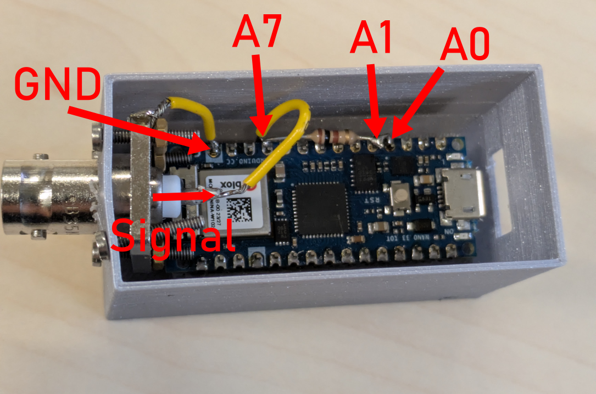

# DemoSMU

This repo contains all necessary information to build and use the DemoSMU, a tiny source-measure unit (source and measure voltage &amp; current) built from an Arduino Nano 33 IoT.

<video src="Images\DemoSMU_IV_curve.mp4" style="width: 75%; height: auto;" controls></video>

Here we use the DemoSMU to perform a simple current-voltage measurement of a diode using NOMAD CAMELS to control the instrument.

## Arduino Nano 33 IoT

The Arduino Nano 33 IoT is a small, powerful board based on the SAMD21 microcontroller. The board operates at 3.3V and has a variety of analog and digital pins for interfacing with sensors and other components. It costs around 20€ to 30€.

Its `A0` pin is used as a DAC (Digital-to-Analog Converter) to output voltage or current, while the `A7` pin is used as an ADC (Analog-to-Digital Converter) to measure voltage or current. To measure the current, the voltage drop between `A1` and `A7` is measured and divided by the known shunt resistor value (100 Ohm recommended).

## Setting up the Arduino Nano

Load the provided Arduino sketch `/Arduino_code/k2400_emulator.ino` onto the Arduino Nano 33 IoT using the Arduino IDE.

You can modify the shunt resistor value in the sketch if you are using a different value than the recommended 100 Ohm. This is done on line 24:

```cpp
static const float SHUNT_RESISTANCE = 96.6f;    // ohms (adjust to your shunt)
```

The `.ino` assumes you are using a reference voltage of 3.3V. Adjust line 23 if this is not the case.

> [!NOTE]
> The Arduino Nano is emulating a Keithley 2400 SourceMeter, so you can use any software that supports the Keithley 2400 to control the DemoSMU. This is tested using [CAMELS](https://fau-lap.github.io/NOMAD-CAMELS) and provides a very simple source-measure unit that can be integrated into existing setups easily.

Reading voltage and current samples 100 times. The average of these samples is used as the measurement result. This helps to reduce noise in the measurements. To change this, modify lines 82 and 90.

When setting the voltage it iterates 10 times to get the best match of read value to set point, for setting current it does this 75 times. To speed things up you can reduce this by changing lines 191 and 276.

## Hardware Setup

Requirements:

- Soldering iron
- 2x short wires
- 100 Ohm resistor
- 3D printed case and lid (optional, `.stl` files in `/3D_printing`)


Steps:

1. Solder 100 Ohm resistor to pin `A0` and `A7`.
2. Connect `A0`and `A1` directly.
3. The device under test (DUT) should be connected between `A7` (positive terminal) and `GND` (ground). In the image above we use a simple BNC connector for this, but any other connection (like a simple wire) to your DUT works as well.

### 3D printing

The `.stl` files for a simple case and lid are provided in the `/3D_printing` folder. The case has a hole for a BNC connector, but you can also simply connect wires to the `A7` and `GND` pins if you do not need a connector.

## Connect the Arduino to your PC

Use a USB cable to connect the Arduino with your PC. The Arduino will create a virtual COM port that can be used to communicate with it.

## Using the DemoSMU

For measurement software the connected Arduino is a Keithley 2400 SourceMeter. You can use any software that supports this device. 

### Available Commands

> [!NOTE]
> Only voltage and current can be read and set. Does not support reading resistances directly.

The following SCPI commands are supported:

|Command|	Type|	Description|
| --------|--------|--------------|
|*IDN?	|Query	|Returns the identification string: Arduino,Nano33IoT,SCPI-Emulator Keithley 2400,1.0|
|:CONF?|	Query|	Returns the currently configured measurement function ("VOLT", "CURR", or "RES").|
|:READ?|	Query|	Performs the measurement based on the current configuration (voltage or current) and returns the result as a single float.|
|:SOUR:VOLT <value>|	Command|	Sets the output voltage to the specified value in volts.|
|:SOUR:CURR <value>|	Command|	Sets the output current to the specified value in amperes.|
|:OUTP ON|	Command|	Enables the output. Currently does not do anything!|
|:OUTP OFF|	Command|	Disables the output. Currently does not do anything! |

The Arduino will ignore most commands it does not support silently. To add functionality or change it, modify the `.ino` file.


## Accuracy and Limits

The voltage and current setting is not very accurate due to the limited resolution of the DAC and ADC on the Arduino Nano 33 IoT. The voltage can be set with a resolution of approximately 3mV (3.3V with 1024 steps). The maximum output current of the Arduino is 7mA.

## Dimensions

The dimensions of the DemoSMU (the case) are approximately 60mm x 30mm x 40mm.


